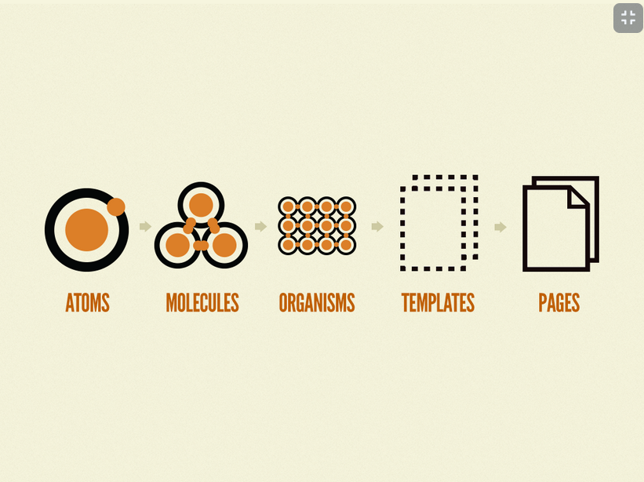
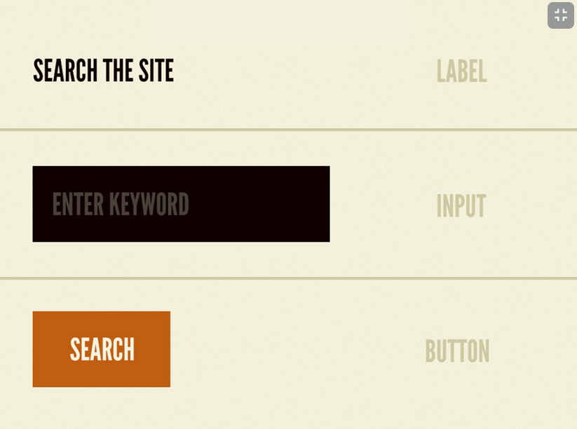
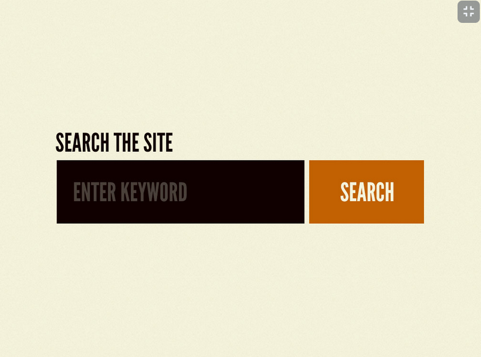

## **Conceptos fundamentales de React**
---

**JSX**

Es la extensión de archivos que se usa en react donde podemos hacer html dentro de js facilitando el uso sacando lo mejor de html css y js.

**Virual DOM**

Es una copia del DOM real y lo que hace es compararlo, asi cuando existe algun cambio no se tiene que renderizar toda la pantalla si no solo lo que se cambio mejorando el desempeño de nuestra app, como lo comente antes esto es por que se compara el Virtual DOM con el DOM Real encontrando los cambios

**Ciclo de vida**

Este concepto es ampliamente conocido en la programación, en este curso vamos a conocer cual es el ciclo de vida de los elementos que vamos a crear en react desde que nace, se combina hasta que muere

**Estado**

Esto es fundamental, ya que podemos ver los estados y ver como es el flujo de la información entre componentes a travez de un imputs, botones, interacciones entre otros elementos. Los estados son muy importantes en React, pues son encargados de actualizarse cada vez que se cambian, afectando a los demás nodos del virtual DOM.

**Eventos**

Los componentes, pueden configurarse con eventos como onclick para responder antes ciertas interacciones con el usuario, tal como los haríamos en Html

**React Hooks**

Es otra manera de escribir los componentes con estado, si usar clases. No se pretenden reemplazar, sin embargo, usar funciones para los componentes pueden facilitar el entendimiento de la aplicación


**OJO**

En la documentación de Sass desaconsejan usar @import para traer archivos de estilos externos.

`@import //The Sass team discourages the continued use of the @import rule.`

En cambio recomiendan usar @use, esto evita que variables, mixins, placeholders y funciones sean accesibles de manera global, mejora el tiempo de compilación entre otros problemas que surgen cunado se usa @import

`@use 'path/for/external/styles';`

[documentacion](https://sass-lang.com/documentation/at-rules/import)


## **¿Qué es router en React?**

Debido a que React es de tipo SPA(single page application), no recarga la página cuando cambiamos de url. Sin embargo, router nos ayuda a crear otra página para poder navegar en nuestra aplicación. Imagina twitter web, cuando das click en un tweet, se abre otra sección donde puedes ver el tweet. Sería un problema que al momento de darle click, no cambie la url, por lo que ese tweet no tiene dirección propia, no se guardaría en tu historial y sería un problema el SEO. Para ello, usamos router, que se encargará de administrar esta situación, donde en el momento que abras el tweet, cambie la URL, pero todavía mantenga ese dinamismo y rapidez de una SPA.

**¿Entonces qué es ReactRouterDOM?**

```
#Para instalar
npm install react-router-dom
```

```
//import en App.jsx
import { BrowserRouter, Routes, Route } from 'react-router-dom';
// usaremos esas 3 herramientas
```

**ReactRouterDOM** te permite implementar enrutado dinámico en la aplicación. Nos facilita pues podemos enrutar nuestra app basada en componentes de la app (como login o recoverypassword).

```
<BrowserRouter>
	<Layout>
		<Routes>
			<Route exact path="/" element={<Home />} />
			<Route exact path="/login" element={<Login />} />			
            <Route exact path="/recovery-password" element={<RecoveryPassword />} />
			<Route path="*" element={<NotFound />} />
		</Routes>
	</Layout>
</BrowserRouter> 

```

**¿Qué estamos haciendo?**

- **BrowserRoute** sirve para implementar router en el navegador.

- **Routes**  Este componente es el encargado de que solo se renderice el primer hijo Route o Redirect que coincide con la ubicación. Si no usar este componente todos los componentes Route o Redirect se van a renderizar mientras cumplan con la condición establecida.

- **Layout** solamente renderizará el route que coincida efectivamente con la URL especificada.


## **¿Qué es atomic design?**
---



Piensa en una aplicación. Identifica cada parte, navega por ella, cambia de sección. Te das cuenta? muchos componentes son muy parecidos. Conoce a atomic design, una metodología encargada en interfaces.

**Átomos**

Ahora necesito que recuerdes las clases de química. Sabrás que todo en el universo está compuesto por átomos. Este es nuestro primer nivel de abstracción. Cuando diseñes un UI, mira los botones, textos, imágenes o entradas de texto. Son las partes más fundamentales y pequeñas que usamos.



La **imágen** de arriba te ayudará a identificar que cosas pueden tomarse como átomos en tu próxima aplicación.


**Moléculas**

Las moléculas son una unión de átomos. Todas estas moléculas, normalmente tienen una función específica para la cuál necesitan varios átomos. Por ejemplo, la glucosa C6H12O6, es la energía en carbohidratos del humanos. Ahora, pasemos al diseño. En interfaces, una parte como un comentario de twitter, una sección de youtube de ME GUSTA y NO ME GUSTA, o el menú en los videos de platzi para avanzar o retroceder en la clase, son todos moléculas. Estas estás compuestas de algunos componentes más pequeños (como por ejemplo, de botón y cuadro de texto). Este es nuestro segundo nivel. Crear moléculas es simple, y recuerda que deberán tener una función única en nuestra UI.



**Organismos**

Los organismos, ya son un nivel mucho más complejo. Los organismo están compuesto de muchas moléculas. Pero lo más interesante, es que tienen vida propia, y pueden interactuar en una manera muy amplia con otros organismos. Imagina una abeja con una flor, ambos colaboran de una u otra manera a que el otro esté bien. En nuestro diseño, imagina al header. El header está compuesto de muchos elementos, y tienen un impacto muy grande en la app. O incluso, de una sección como una tienda de ropa en la paǵina web. Seguramente te das cuenta, que estos tienen muchos artículos, y todos constan de una imaǵen, precio, y un ordenamiento. Puedes verlo así:

*Átomo⇒ imágen, precio, descripción*

*Molécula ⇒ el cuadro que contiene a la imágen, al precio y a la descripción.*

*Organismo ⇒ todos los cuadros ordenados en forma de tabla.*

El organismo si te das cuenta, puede usar moléculas del mismo tipo o diferentes. El punto clave, es que no trates de abarcar tanto, y que pertenecen a una sección claramente definida en nuestra app.


**Templates**

Los templates son prácticamente lo que vimos de Layouts. Es un poco más fácil de comprender. Es la plantilla en la cual siempre organizarás los organismos. Es decir, el esqueleto que indica donde irá por ejemplo, el Header, el footer, grid y sección de comentarios.


**Pages**

Finalmente tenemos a la constitución de nuestra app. Las pages son en sí, toda la página funcionando con contenido interactúando entre ellas.


*Una recomendación. No pienses en forma secuencial el atomic design. Es decir, no pienses ⇒ primero hago los átomos, después hago las moléculas, tercero los organismos… Según el mismo autor de atomic design, dependerá mucho de tu aplicación y de las necesidades que hay que cubrir. Más bien, es una manera mental de interpretar la UI.*

*No atribuyas atomic design como algo único de React o del desarrollo web ⇒ es un método de desarrollo de UI que se puede usar en cualquier interfaz.*

Te recomiendo profundamente leer el siguiente link, del cual usé toda la referencia. Además, es del autor del Atomic Design.

[Atomic Design Methodology](https://atomicdesign.bradfrost.com/chapter-2/)

## **Tipos de componentes en React: stateful vs. stateless**
---
Clase 14/29

Este es un ejemplo para useState, podemos darle un valor inicial, el cual puede ser cambiado por un evento que se puede asignar a este mismo componente, o a otros componentes y hasta pasarlo por medio de un hijo para que éste cambie el inicial.

Para poder usar componentes stateful es necesario llamar useState desde React, la forma de importarlo y usarlo es la siguiente:

```
import React, { useState } from 'react';

const Button = () => {
    const [name, setName] = useState('Hola Mundo'); 
    return (
        <div>
            <h1>{name}</h1>
        </div>
    );
}
```

Los componentes stateless servirán para pasar un estilo visual o props, pero no tendrá otra función más que esa.

Este sería un componente sin estado, stateless.

```
import React from 'react';

const Button = ({ text }) => <ButtonRed text={text}/>;
```

También esta forma es válida:

```
import React from 'react';

const Button = () => (
        <div>
            <h1>Hola mundo!</h1>
        </div>
);
```

Es por eso que hay que tener presente que `NO` todos los componentes deben de tener estado y muchos de ellos sólo llevarán información que presentar directamente al HTML con CSS, pero sí serán parte de todo lo que se está construyendo.

Los componentes Stateful y Stateless, son los componentes más utilizados hoy en día.

También hay otro tipos de componentes, que están compuestos por clases.

Aquí, tendremos una clase, con el nombre que queramos, que extiende de React.Component

```
import React from 'react';

class App extends React.Component {
    render() {
        return (
            <div>
                <h1>Hello world! </h1>
            </div>
        )
    }
}
```

Aunque, si importamos React Component, desde un inicio, podemos simplemente escribirlo de esta forma:

```
import React , { Component } from 'react';

class App extends Component {
    render() {
        return (
            <div>
                <h1>Hello world! </h1>
            </div>
        )
    }
}
```

Este tipo de componentes trabajan con constructores, aunque ya no son tan usados, pues han sido reemplazados por la propuesta de React Hooks.

```
import React , { Component } from 'react';

class App extends Component {

    constructor() {
        super();
        this.sate = {
            count: 0
        };
    }

    render() {
        return (
            <div>
                <h1>Hello world! </h1>
            </div>
        )
    }
}
```

Es importante conocer este tipo de componentes porque si en algún momento tenemos que dar mantenimiento a alguna página que fue construida hace unos años atrás, es muy posible que nos encontremos este tipo de componentes.

Los hooks, tienen una funcionalidad particular, pues reciben un componente, extienden su funcionalidad con lo que esté dentro del componente y retornan un componente compuesto. Así podemos tener funcionalidades muy específicas con las que podemos trabajar según nuestras necesidades.

Esta sería la sintaxis:

```
import React , { Component } from 'react';

function ComponentWrapper(WrapperComponent) {
    class Wrapper extends Component {
        render () {
            return <WrapperComponent {...this.props} />;
        }
    }

    return Wrapper;
}
```

Más adelante aprenderemos más sobre React Context y cómo usarlo.


## **¿Cómo usar useState?**
---

useState es una manera de usar estado con los React Hooks. Recordemos que los estados son maneras en la que un componente puede administrar información cambiante en el entorno, y después de ser llamado se renderiza el React DOM de nuevo.

Para ello primero importamos useState de react:

`import React, { useState } from 'react';`

Ahora, useState será incorporado en nuestro componente ProductItem

```
const ProductItem = () => {
	const [cart, setCart] = useState('Hola');

	const handleClick = () => {
		setCart('Hola mundo');
	}
}
```

Para poder usar los estados, primero debemos crear una constante en la cual tendrá un array. El primero elemento en este caso cart será la variable a la cual le asignaremos un valor de estado. Este valor puede ser de cualquier tipo. En segundo lugar tenemos a setCart. Por convención siempre deberemos escribir esta “función” con set(Variable). Esta será la encargada de asignar un valor cualquiera a cart cada vez que exista algún evento. Esto lo igualamos a `useState`, que es como una manera de inicializar la variable cart. En segundo lugar tenemos a la función `handleClick`. `handleClick` es la función que dada un evento, como un click, será llamada y por dentro usaremos a setCart para asignarle un nuevo estado a la variable cart. No podemos usar directamente setCart, pues puede dar algún error y no es la manera correcta. Por ello, después en el return, donde tenemos el html, lleva la siguiente estructura.

```
<figure onClick={handleClick}>
		
</figure>
```

Al momento de darle click en figure, llama a la función `handleClick` del componente, y `handleClick` por dentro cambiará el estado de la variable de estado por uno nuevo. En este caso, cambiamos el valor de cart de hola, por hola mundo.

**¿Cómo acceder a la variable?**

Para acceder a dicha variable cart en el html, podemos usar llaves en donde pasaremos el nombre. Esto es más fácil, pues de otra manera, tendremos que usar más array’s y acceder con el índice, el cual dificulta la lectura del código.

```
<div className="product-info">
				<div>
					<p>$120,00</p>
					<p>Bike</p>
				</div>
				<figure onClick={handleClick}>
					
				</figure>
				{cart} // acceder a la variable
</div>
```

## **useEffect y consumo de APIs**
---

**useEffect** es una manera de que nuestro componente de React, puede recibir nueva info, re-renderizar o cambiar su contenido, cuando una función se haya completado. Es decir, podemos controlar el momento en el cual nuestro componente tome un cierto comportamiento. Por ejemplo, en situaciones como funciones asíncronas ⇒ `setTimeout` o `async` y `await`, fetch requests o manipulaciones del DOM. Veamos un ejemplo de como usar useEffect.

**Pre-configuración**

*Instalar axios para realizar peticiones get, también instalar el plugin de babel para manejar el asincronismo*

```
npm install axios
npm install @babel/plugin-transform-runtime
```

Editemos rápidamente .babelrc

```
{
	"presets": [
		"@babel/preset-env",
		"@babel/preset-react"
	],
	"plugins": [
		"@babel/plugin-transform-runtime"
	]
}
```

Ahora si veamos como funciona.

```
// ProductList.jsx
import React, { useEffect, useState } from 'react';
import ProductItem from '@components/ProductItem';
import axios from 'axios';

const API = 'https://api.escuelajs.co/api/v1/products';

const ProductList = () => {
	const [products, setProducts] = useState([]);

	useEffect(async () => {
		const response = await axios(API);
		setProducts(response.data);
	}, [])

	return (
		<section className="main-container">
			<div className="ProductList">
				{products.map(product => (
					<ProductItem />
				))}
			</div>
		</section>
	);
}
```

En el inicio estamos importando axios para las peticiones, y creando una constante API que será la necesaria para traer información de los productos

Analicemos el componente productList. Al inicio creamos la estructura inicial de estado, en la cual guardaremos los artículos que traeremos de nuestra API. Ahora, como indicamos, useEffect es muy útil para peticiones HTTP. Para ello, creamos la función anónima que usa useEffect. Por dentro creamos la función que usara async. Dentro creamos una constante llamada response a la cual creamos la petición y guadamos el resultado de la API. A continuación, usamos setProducts para poder guardar la información nueva en products, por eso por dentro le pasamos response.data. Lo más destacable viene ahora, en el momento que pasamos un segundo argumento a useEffect.

**Maneras de usar useEffect**

- **Array Vacío:** ejecuta el callback solamente una vez, después de que el componente sea cargado en el DOM. Es decir, solamente cuando nuestro componente este cargado en el DOM, ejecutará la función por dentro SOLO UNA VEZ y nunca más

```
const ProductList = () => {
	const [products, setProducts] = useState([]);

	useEffect(async () => {
		const response = await axios(API);
		setProducts(response.data);
	}, [])
}
```

- **Sin argumentos:** cuando usemos useEffect, pero sin segundo argumento, este ejecutará dicho callback cada vez que se re-rendirece en el DOM. Es decir, cada vez que cambie cualquier valor del componente, este callback siempre se ejecuta

```
const ProductList = () => {
	const [products, setProducts] = useState([]);

	useEffect(async () => {
		const response = await axios(API);
		setProducts(response.data);
	},)
}
```

**Array con datos:** este tipo se ejecuta solamente cuando un valor de prop o state de nuestro componente cambie. Es decir, imaginemos que existe un contador interno de clicks. Cada vez que el contador indique explicita mente que un valor del componente cambió, el callback de useEffect siempre se ejecutará.

```
const ProductList = () => {
	const [products, setProducts] = useState([]);

	useEffect(async () => {
		const response = await axios(API);
		setProducts(response.data);
	}, [props, state])
}
```

**Tienen relación a la manera de anterior de componentes con clase**

Usar la manera de array con datos o sin datos son equivalentes a componentDidUpdate o componentDidMount. Así como indica sus nombres ⇒

- Si el componente se actualizó, este ejecuta un callback el cual tiene cierta función. Esta manera es igual a usar useEffect con un array con datos. Es decir, ¿hay nueva info? ⇒ realiza esto cada vez que la info nueva se actualice
- Si el componente se cargó en el DOM, un callback será ejecutado y nunca más. Esta manera es igual a usar useEffect con un array sin datos. Es decir, ¿ya está cargado? ⇒ necesito que hagas esto y después te puedes quedar dormido

- [**Docs de la API**](https://api.escuelajs.co/docs/)
- [**API para el desarrollo**](https://api.escuelajs.co/api/v1/)

## **Custom Hooks para la tienda**
---

En React, podemos crear hooks por nuestra propia cuenta, donde nosotros podemos escribir toda la funcionalidad que deseamos. **Ahora**, haremos un hook el cual servirá para realizar la petición a todos los productos y traer su precio, imágen y descripción.

```
//useGetProducts.js
import { useEffect, useState } from 'react';
import axios from 'axios';

const useGetProducts = (API) => {
    const [products, setProducts] = useState([]);

	useEffect(async () => {
		const response = await axios(API);
		setProducts(response.data);
	}, [])

    return products;
}

export default useGetProducts;
```

El hook es muy sencillo. En el, creamos una array llamado products. Después con ayuda de useEffect realizamos una solicitud a una API (que es pasada como argumento), para traernos toda la información y guardarla con ayuda de axios. setProducts (de useState) guarda el response. Al final regresamos products.

Para poder usar el custom hook, lo implementamos en ProductList

```
// ProductList.jsx
import useGetProducts from '@hooks/useGetProducts'; // Lo importamos

const API = 'https://api.escuelajs.co/api/v1/products';

const ProductList = () => {
	const products = useGetProducts(API);

	return (
		<section className="main-container">
			<div className="ProductList">
				{products.map(product => (
					<ProductItem product={product} key={product.id}/>
				))}
			</div>
		</section>
	);
}
```

Ahora, creamos una constante llamada products que será el mismo array el cual contiene toda la información de los productos. En el, le pasamos API que será un argumento del hook. Como ya sabemos, más abajo en el div, usamos el método map para el array, en donde por cada producto creará una etiqueta del componente ProductItem. ProductItem recibe como datos un key, que es igual a product. id y también product que es igual al producto del array.

Para poder aprovechar esta información, editamos ProductItem.

```
import React, { useState } from 'react';
import '@styles/ProductItem.scss';
import buttonAddCart from '@icons/bt_add_to_cart.svg'

const ProductItem = ({product}) => {
	const [cart, setCart] = useState([]);

	const handleClick = () => {
		setCart([]);
	}

	return (
		<div className="ProductItem">
			
			<div className="product-info">
				<div>
					<p>${product.price}</p>
					<p>{product.title}</p>
				</div>
				<figure onClick={handleClick}>
					
				</figure>
			</div>
		</div>
	);
}

export default ProductItem;
```

En product item, recibimos estos datos en argumentos de la función dentro de llaves. Más abajo, en img, alt, y p, usamos las características de cada producto que son la imágen, titulo, descripción y precio. Así, podemos mostrar la información que corresponde a cada una.

## **useRef y formularios**
---

**Características y diferencias entre useRef y useState**

useRef es un hook utilizado para obtener una referencia a los datos de un objeto con información mutable. Es decir, es como una manera de siempre poder obtener los datos mas recientes mediante referencia de algún objeto de html. En este caso referenciamos a los valores recientes de un formulario. Dos características importantes de useRef es que los datos son persistentes en caso de que se re-renderice el componente. Así como también, actualizar los datos de esta referencia no causan el re-render. Cabe recalcar la diferencia con useState, que la actualización de datos es síncrona, ya además como hemos mencionado, no se re-renderiza.

useRef:

    Genera una referencia al elemento y podremos acceder a los valores por medio de ‘current’, y por este medio obtener lo que estamos typeando según sea el caso y poderlo transmitir a donde lo necesitemos.

    El elemento que tendrá la referencia debe tener atributo: ref={NOMBRE_USEREF}

    Podemos acceder a toda la data de la siguiente manera: new FormData(NOMBRE_USEREF.current);

    El elemento también debe tener un atributo: name=“NOMBRE” y podremos acceder a la data que trae en current de la siguiente manera: formData.get(‘NOMBRE’);


## **React Context**
---

¿Qué es react context?

React context es una manera de acceder a un tipo de “variables globales” entre nuestros componentes de react. Es decir, hay situaciones en las que quisieramos pasarles datos importantes a un componente de react, y a todos sus nodos hijos. Sin embargo, usando props esta tarea es muy repetitiva y poco efectiva de mantener. Incluso, existen ocasiones que le pasamos props a nodos obligadamente aunque nunca la necesiten. Es aquí cuando entra en acción react context. Nosotros podemos acceder desde donde sea a una variables en nuestra aplicación. E inlcuso podemos crear cuantos contexto queramos donde cada uno mantendra información necesaria.


## **Orden de compra**
---

En esta clase, implementaremos una manera para poder desplegar nuestro carrito de compras. Para ello, debemos acceder primero a Header.jsx, donde está el ícono del carrito de compras

```
//Header.jsx
import MyOrder from '@containers/MyOrder';

const Header = () => {
	const { state } = useContext(AppContext);
	const [toggleOrders, setToggleOrders] = useState(false);	

	const handleToggle = () => {
		setToggle(!toggle);
	}

	return (
			<div className="navbar-right">
				<ul>
					<li className="navbar-shopping-cart" onClick={() => setToggleOrders(!toggleOrders)}>
						
						{state.cart.length > 0 ? <div>{state.cart.length}</div> : null}
					</li>
				</ul>
			</div>
			{toggleOrders && <MyOrder />}
		</nav>
	);
}

export default Header;
```

Ahora, para poder mostrar el carrito de compras, añadimos otra variable de estado en el componente llamada toggleOrders. Esta se inicializa en falso para indicar que no queremos mostrar el carrito. Para ello, añadimos 2 expresiones. Una en donde solamente se añadira el nodo MyOrder si toggleOrders es verdadero. Por eso se inicia en falso. El evento que se ejecuta cuando damos click esta en el carrito de compras. Añadimos un onClick, el cual ejecuta una función anónima en la que cambia el valor booleano de toggleOrders. Así, cada vez que demos click, alterna en visibilidad. Para que se pueda ver bien el elemento, editamos el css.

```
// MyOrder.scss
.MyOrder {
	top: 60px;
	bottom: auto; // créditos => @Manuel Valencia Londoño
	border-radius: 6px;
	border: 1px solid var(--very-light-pink);
}
```

Ahora, una vez tenemos la lógica para mostrar el elemento de MyOrder, con todas las ordenes correspondientes, debemos editar este mismo componente, para que se muestren tantos elementos en el carrito como diga el contexto. Es decir, si en el carrito hay 5 productos, después en el menu de MyOrder deberían haber 5 elementos. Para ello, editamos MyOrder.jsx

```
// MyOrder.jsx
import React, { useContext } from 'react'; // añadimos useContext
import AppContext from '@context/AppContext'; // añadimos AppContext

const MyOrder = () => {
	const { state } = useContext(AppContext);

	return (
			<div className="my-order-content">
				{state.cart.map(product => (
					<OrderItem product={product} key={`orderItem-${product.id}`}/>
				))}
			</div>
		</aside>
	);
}

export default MyOrder;
```

Ahora, lo que hacemos es traer las herramientas necesarias para poder trabajar con contexto. En el componente, traemos el valor de state y lo guardamos como contexto para poder acceder a dicho estado.

*Este es un ejemplo perfecto del uso de context, donde simplemente cada componente accede a las variables si es necesario o no. No hay que trasladar estos datos de manera tediosa y repetitiva*

Como en state tenemos un array, por ello creamos una lógica con map. Al ejecutar state.cart.map estaremos recorriendo cada elemento de state (es decir, del array de los elementos del carrito) Y regresamos un nodo llamado OrderItem. En orderItem le pasamos un valor product y key, en el cual podrán guardar cada componente un elemento product y un key identificador único. Simplemente editamos de tal manera que el key sea totalmente único, por ello usamos templateliterals.

## **Calculando el precio total**
---

Para calcular el precio real de los elementos añadidos al carrito y poder mostrar la información correctamente, trabajaremos sobre MyOrder y OrderItem.

```
// OrderItem.jsx
import React from 'react';

const OrderItem = ({ product }) => {
	return (
		<div className="OrderItem">
			<figure>
				
			</figure>
			<p>{product.title}</p>
			<p>{product.price}</p>
			
		</div>
	);
}

export default OrderItem;
```

Primero, en OrderItem recordemos que desde MyOrder le estabamos pasando el producto. Sin embargo, en todos los casos estábamos mostrando una bicicleta. Ahora, para poder mostrar la información de cada producto, simplemente le indicamos al componente que recibimos como parámetro un product. Después, editamos el HTML, para que la imágen, título y precio correspondan al del producto, así que solamente accedemos a las propiedades de cada uno.

```
// MyOrder.jsx
const MyOrder = () => {
	const { state } = useContext(AppContext);

	const sumTotal = () => {
		const reducer = (accumulator, currentValue) => accumulator + currentValue.price;
		const sum = state.cart.reduce(reducer, 0);
		return sum;
	}

	return (
		<div className="order">
				<p>
					<span>Total</span>
				</p>
			<p>${sumTotal()}</p>
		</div>
	);
}

export default MyOrder;
```

Ahora, editemos el componente MyOrder. En my order, creamos una función llamada sumTotal donde creamos la lógica de la suma de los precios de los productos del carrito. Para poder crear esta función, primero creamos la función llamada reducer, en la cual le pasamos dos valores, un acumulador y un valor corriente, para después regresar la suma de ambos. Después, en la constante sum, usamos el método reduce para los arrays. El método se aplica sobre el array state.cart con todos estos elementos. Simplemente, le pasamos la función antes definida, y un valor inicial igual a cero. Por último, regresamos sum. Más abajo, en la etiqueta p, entre llaves indicamos que se ejecute esta función para calcular el precio cada vez que se renderice el componente.

## **Eliminando productos del carrito**
---

Vamos creando la lógica para crear una función que elimine productos del carrito. Recordemos, que la función para poder añadir la teníamos en nuestro hook, así que ahí mismo vamos a crear una función para eliminar.

```
// useInitialState
import { useState } from "react";

const useInitialState = () => {
    const removeFromCart = (payload) => {
        setState({// minificado
            cart: state.cart.filter(item => item.id !== payload.id),
        })
    }

    return {
        state,
        addToCart,
        removeFromCart,
    }
}

export default useInitialState;
```

Dentro del hook, vamos a crear una función llamada removeFromCart. Esta función recibirá como parámetro un payload ( o el producto ), y después actualizaremos el estado. Para ello, con ayuda de setState, indicamos que ahora el estado seguirá siendo un objeto, donde cart, será el array, PERO usaremos el método filter, donde eliminaremos el item del array con ayuda de su id, y después regresará el array sin este elemento. Al final, tenemos que regresar la nueva función en el hook, es decir, añadir return … , removeFromCart.

```
// OrderItem.jsx
import React, { useContext } from 'react';
import AppContext from '@context/AppContext';

const OrderItem = ({ product }) => {
	const { removeFromCart } = useContext(AppContext);

	const handleRemove = () => {
		removeFromCart(product);
	}

	return (
		<div className="OrderItem">
			 handleRemove(product)} />
		</div>
	);
}

export default OrderItem;
```

Recordemos, que el ícono de eliminar, lo tenemos en OrderItem, así que este componente será el encargado de usar la función para remover el producto. Para ello, debemos importar también useContext para poder trabajar con el contexto. Para implementar la función, creamos una constante donde traemos la función removeFromCart del contexto. Después, creamos una función que se encargará de manejar el click sobre el ícono de eliminar. En esta función, siempre ejecutaremos la función removeFromCart con el argumento product, para eventualmente quitarlo de nuestro carrito de compras.

## **Automatizando el despligue con GitHub Actions**
---

**Usar GitHub Pages:**

- npm install —save-dev gh-pages
- Agregar reglas al package.json:
    - [homepage](https://SergioMaurySterling.github.io/NOMBRE_REPO)
- Crear nuevos scripts en package.json
    - “predeploy”:“npm run build”, :Este ejecutara automáticamente después el “deploy”
    - “deploy”:“gh-pages -d build”
- npm run deploy (Crea nueva carpeta llamada build que tiene todos nuestros archivos del proyecto)
- En GitHub ingresamos a:
    - Settings
    - Pages
    - Podemos ver el link de publicación

**GitHub Actions / Pages**
- https://github.com/marketplace?type=&verification=&query=deploy+github+page+
- Deploy to GitHub Pages script
- Crear folder llamado “.github”, adentro otra llamada workflows, y adentro un archivo llamado deploy.yml
- Copiar el primer recurso y pegarlo de forma manual, personalizado en el archivo deploy.yml
- Cambiar el nombre de la carpeta “build” a “diste” ya que esa acciona todo
- Tener el repo actualizado y todo en la rama main o principal
- Podemos revisar en el repo, en actions que el workflow corra y finalice exitosamente
- Settings -> pages: Cambiar el source a la rama gh-pages y guardar
- Configurar dominio:
    - Se pone el dominio en Custom Domain
    - Ingresamos al dashboard de Cloudflare -> DNS
    - https://docs.github.com/en/pages/configuring-a-custom-domain-for-your-github-pages-site/managing-a-custom-domain-for-your-github-pages-site
    - Agregamos en Cloudflare los 4 apuntadores A que nos entrega GitHub
    - Agregamos CNAME, con nombre www, que apunte a nuestro dominio personal

**Desplegar una app de React junto con otros proyectos en GitHub Pages**

[**Tutorial**](https://platzi.com/tutoriales/2484-react-practico/12068-desplegar-una-app-de-react-junto-con-otros-projectos-en-github-pages/)


## **Apuntes compañero**
---

[Apuntes](https://potent-eye-335.notion.site/Curso-Pr-ctico-de-React-js-3f906a6fc6784a12af4d7630d3f55fcf)